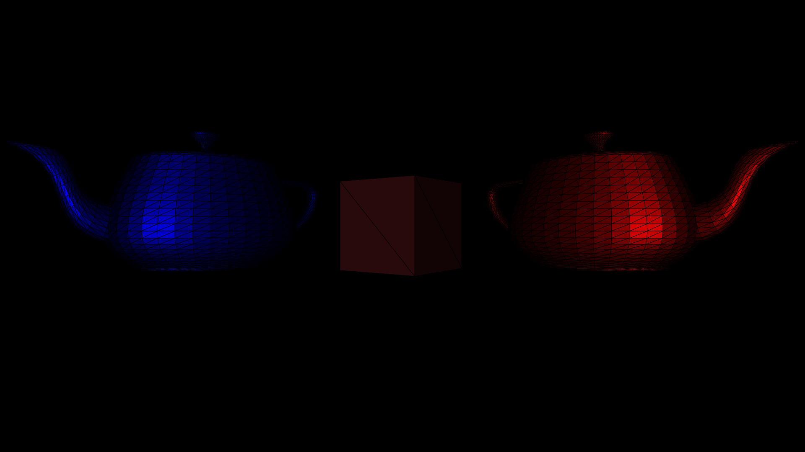

# Minimal Graphics library

## Table of Contents

+ [About](#about)
+ [Getting Started](#getting_started)
+ [Usage](#usage)

## <a name = "about">About</a>

 This is just a little project I work on
 in my free time. Mainly for easy access
 in the future but it'll (Hopefully)become
 publically available at some point. I
 based this library on a project I did
 in early 2023 and now it's here.

 Why I made it and what it's for?
 I decided to make this library/module
 because I wanted an easy-to-use
 intuitive 3d rendering library that
 was minimalistic and was easy to
 interact with. you could render the
 output triangles to virtually any
 viewport in python3.

 Happy Coding!

### UNMAINTAINED  
From 12/07/2024

## <a name = "getting_started">Getting Started</a>

To get this library running download the Main.py file and put it into your projects folder, then you need to just import it like you would any other Python3 library(by whatever the filename is). That's it, then you can create instances of the classes to use the library/module(whatever you want to call it).  
### Features  
- Shading  
- Versatile usage  
- Lightweight  
- Multiple formats supported  

## <a name = "usage">Usage</a>

### Initiating the library:

To initiate the gl create an instance:

```
Import Main  
screen_width = 1920  
screen_height = 1080  
camera_fov = 55 
max_z_distance = 1000  
min_z_distance = 0.1  
gl_example = Main.gl(screen_width, screen_height, camera_fov, max_z_distance, min_z_distance)
```

Then add the example teapot.obj model to the libraries map array:
***Note:*** Defining a colour makes the whole object one colour

```
model = 'models/teapot.obj'  
x, y, z = 0,0,0  
x_axis_angle = 0  
y_axis_angle = 45  
z_axis_angle = 180  
colour = None  
cube = Main.object(model, x, y, z, x_axis_angle, y_axis_angle, z_axis_angle, colour)  
```

To then render a test image in one of the supported formats:

```
background_colour = '#000000'  
file_location = 'images/output'  
file_fornmat = '.svg'  
renderer.render_image(background_colour, file_location, file_format)  
```

To initiate a light you need to create an instance:

```
x, y, z = 0, 0, 10
r, g, b = 1, 1, 1
light1 = Main.light(x, y, z, r, g, b)
```

You can also choose the viewstyle of the renderer. Solid or wire mesh, background colour/brightness and outline colour:

```
wiremesh = False
background, outline_colour = 0, ''
renderer.view_style(wiremesh, background, outline_colour)
```

Here's an example of solid vs wire mesh:

### *Solid:*


### *Wire Mesh:*


### Rendering:

To render an image use the render_image function within the gl class, make sure to include the filename excluding the extension in the output_path:

```
output_path = 'images/output'
file_format = '.svg'
outline_width = 1
renderer.render_image(output_path, file_format, outline_width)
```



### Moving things:

To move the camera locally use:

```
x, y, z = 0,0,0  
x_axis_angle = 0   
y_axis_angle = 0  
z_axis_angle = 0  
gl_example.move_camera(x, y, z, x_axis_angle, y_axis_angle, z_axis_angle)  
```

To set the absolute position of the camera use:

```
x, y, z = 0,0,0  
x_axis_angle = 0   
y_axis_angle = 0  
z_axis_angle = 0  
camera_absolute(x, y, z, x_axis_angle, y_axis_angle, z_axis_angle)  
```

To move a light locally use(there''s no angle as all lights are planes faceing the origin):

```
x, y, z = -1, 1, 0
light1.move_light(x, y, z)
```
